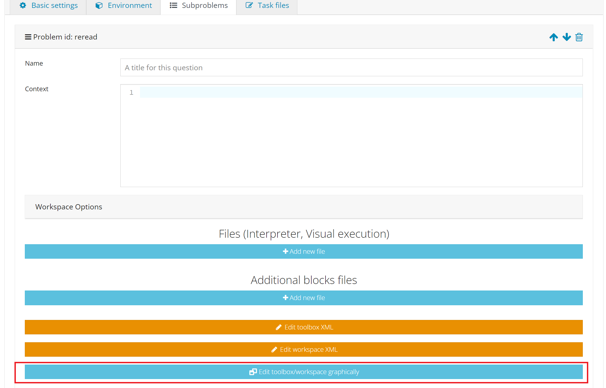

Tutoriel Avancé - Bloc
==================================

Création d'une tâche Blockly *basique*.
---------------------------------------

Si vous souhaitez configurer la tâche vous-même ou vous plonger plus profondément dans les tâches de type bloc, cette partie du tutoriel est pour vous.

Il y a, tout d'abord, quelques étapes pour configurer une tâche. Ce sont :

TODO mettre le lien vers "comment créer une tâche sur inginious ..."

1. Créer la tâche. Définissez un titre, un contexte, votre nom, les options que vous voulez,... Lorsque vous créez un sous-problème, sélectionnez "blockly" comme "type de tâche", donnez-lui un ID et n'oubliez pas de sauvegarder en cliquant sur "Enregistrer les modifications".
2. Si vous le souhaitez, dans le bouton "Option de l'espace de travail", définissez le nombre maximum de blocs que l'étudiant peut utiliser pour réaliser la tâche en l'entrant dans le champ "Nombre maximum de blocs" ("Infini" par défaut)

.. image:: ../images/img_en/block/number_of_blocks.png
   :align: center
   :width: 75 %

3. N'oubliez pas de modifier l'"environnement" en conséquence. Par exemple, dans une tâche blocs, vous choisirez "Conteneur standard (Docker)" pour le "Type d'environnement d'évaluation". Vous devez également modifier l'"Environnement d'évaluation" en fonction du langage de programmation que vous utiliserez. Mettez "Default" si vous n'êtes pas sûr. 

Il y a deux façons de configurer Blockly : soit en utilisant l'interface graphique intégrée, soit en entrant les blocs à la main. Comme la première solution est plus facile à utiliser pour les débutants, nous allons l'explorer en premier. Dans l'onglet "Sous-problèmes", ouvrez votre tâche et faites défiler vers le bas, cliquez sur "éditer la boîte à outils/espace de travail graphiquement". 

Vous aurez accès à ceci :

.. image:: ../images/img_en/block/base.png
   :align: center

La partie gauche est l'endroit où vous pouvez configurer l'outil, et la partie droite affiche un aperçu en direct de ce que vous avez fait jusqu'à présent. La partie gauche comporte deux onglets : la boîte à outils et l'espace de travail. La boîte à outils contient l'ensemble des blocs que l'élève peut utiliser pour résoudre la tâche. Pour ajouter des blocs, il suffit de cliquer sur une catégorie et de glisser/déposer le bloc que vous voulez dans l'onglet. Voici un exemple :

.. image:: ../images/img_en/block/toolbox.png
   :align: center

Si vous voulez supprimer un bloc, il suffit de le faire glisser vers la corbeille en bas à droite. Maintenant, vous pouvez également ajouter des blocs à l'espace de travail de l'élève, qui serviront de base à l'exercice. Il suffit de cliquer sur l'onglet "espace de travail (workspace)" et de glisser/déposer de la même manière que vous l'avez fait avec la boîte à outils (toolbox).

.. image:: ../images/img_en/block/workspace.png
   :align: center

Voyons maintenant un exemple de ce qui peut être fait pour un exercice simple.

Personnalisez votre tâche : comment créer la fonction somme (en utilisant l'interface graphique)
------------------------------------------------------------------------------------------------

Ici, nous sommes dans le cas où nous voulons que l'étudiant crée une fonction, ce qui signifie que nous devons lui fournir la signature de celle-ci dans l'espace de travail. Notre fonction Somme doit prendre deux paramètres, les deux nombres à additionner (appelons-les a et b), et retourner la somme résultante.

Tout d'abord, cliquez sur l'onglet "Workspace" et ouvrez la catégorie "Function". Parmi les trois blocs, nous avons besoin de la fonction qui renvoie une valeur, qui est le deuxième bloc sur l'image ici.

.. image:: ../images/img_en/block/function.png
   :align: center
   

Maintenant, configurez la fonction. Les icônes de la roue nous permettent d'ajouter des paramètres. Il suffit de nommer votre paramètre (*x* par défaut), puis de connecter le bloc dans le bon espace, comme ceci :

.. image:: ../images/img_en/block/param1.png
    :width: 49 %
.. image:: ../images/img_en/block/param2.png
    :width: 49 %

L'icône "*?*" nous permet de définir une info-bulle (texte qui s'affiche au passage de la souris) en tapant simplement dans le champ :

.. image:: ../images/img_en/block/tooltip.png
   :align: center

Enfin, nous devons nommer notre fonction, en changeant le *to ... with* en ce que nous voulons, ici, *Sum* :

.. image:: ../images/img_en/block/name.png
   :align: center

Maintenant, créons une variable pour contenir le résultat. Cliquez sur la catégorie "Variables" et sélectionnez "créer une variable" (create variable). Saisissez le nom de votre variable, "résultat" par exemple, et elle sera disponible dans la catégorie :

.. image:: ../images/img_en/block/var1.png
    :width: 39 %
.. image:: ../images/img_en/block/var2.png
    :width: 19 %
.. image:: ../images/img_en/block/var3.png
    :width: 39 %

Enfin, sélectionnez le bloc correspondant et branchez-le à l'endroit "retour" (return). Voici notre espace de travail de base terminé, avec l'aperçu :

.. image:: ../images/img_en/block/result1.png
   :align: center

Il est maintenant temps de remplir la boîte à outils avec les blocs nécessaires. Cliquez sur l'onglet correspondant, et sélectionnez les blocs que vous voulez pour la tâche. Dans notre cas, nous devons d'abord recréer toutes les variables précédentes, de la même manière que nous l'avons fait pour la variable *result* (en cliquant sur créer une variable). Voici ce que nous obtenons :

.. image:: ../images/img_en/block/toolVar.png
   :align: center

Ensuite, nous voulons le bloc *set*, donc nous le faisons glisser dans la boîte à outils. En utilisant la flèche à côté du nom de la variable, nous pouvons sélectionner la variable que nous voulons par défaut (*result* dans notre cas) :

.. image:: ../images/img_en/block/pick.png
    :width: 49 %
.. image:: ../images/img_en/block/toolVar2.png
    :width: 49 %

Ensuite, nous ajoutons également les deux variables "a" et "b" créées précédemment. Enfin, nous voulons l'opérateur de somme de la catégorie mathématique :

.. image:: ../images/img_en/block/math1.png
   :align: center

Et voici le produit final avec l'aperçu :

.. image:: ../images/img_en/block/finished.png
   :align: center

Cliquez sur fermer, puis "appliquer les changements", et vous avez terminé avec la partie interface graphique de la création de la tâche. Vous pouvez maintenant visualiser votre tâche sur INGInious et connecter les blocs, mais il n'y a pas encore de correction ou de feedback. Voici à quoi cela ressemblera pour l'étudiant :

.. image:: ../images/img_en/block/studentResult.png
   :align: center

Pour le retour, vous devrez créer un ``run`` et un fichier qui contient la correction de la tâche. Commençons par celui-là, que nous appellerons ``sum.py``. Il doit d'abord récupérer le code de l'étudiant avec une instruction comme celle-ci : ``@@subProblemID@@``. Ensuite, vous pourrez appeler la fonction créée avec son nom (ici "Sum"), et ensuite exécuter les tests que vous voulez. Pour se conformer au fichier d'exécution habituel d'INGInious, vous devez sortir "True" si les tests réussissent, et un retour suivi de ``exit()`` en cas d'échec. Le code suivant est un exemple pour notre fonction somme :

.. code-block:: python
    
    #!/bin/python3
    #Open source licence goes here

    from contextlib import redirect_stdout
    import random

    @@Sum@@ #The id of your subproblem goes here

    if __name__ == "__main__":
        random.seed(55)
        for j in range(6): #let's test 6 times
            a = random.randint(0,10)
            b = random.randint(0,10)
            result = Sum(a, b)
            if(result != (a+b)):
                print("The sum you returned for the values " + str(a) + " and " + str(b) + 
                " is " + str(result) + " when the correct answer is " + str(a+b) + ".")
                exit()
        print("True")

Pour une tâche aussi simple, le fichier de base ``run`` est suffisant, avec seulement deux lignes à modifier, où vous devrez mettre le nom de votre fichier de correction. Voici le code correspondant à notre tâche de somme :

.. code-block:: python
    
    #!/bin/python3
    #Open source licence goes here

    import os
    import subprocess
    import shlex
    from inginious import feedback
    from inginious import input

    if __name__ == "__main__":
        input.parse_template("sum.py") #Replace sum.py by your filename on this line AND the next
        p = subprocess.Popen(shlex.split("python3 sum.py"), stderr=subprocess.STDOUT, stdout=subprocess.PIPE)
        make_output = p.communicate()[0].decode('utf-8')
        if p.returncode:
            feedback.set_global_result("failed")
            feedback.set_global_feedback("Your code could not be executed. Please verify that all your blocks are correctly connected.")
            exit(0)
        elif make_output == "True\n":
            feedback.set_global_result("success")
            feedback.set_global_feedback("You solved the task !")
        else:
            feedback.set_global_result("failed")
            feedback.set_global_feedback("You made a mistake ! " + make_output)

Ces deux fichiers doivent être placés dans le dossier de votre tâche, et la création de la tâche est terminée !

Personnalisez votre tâche : créez la fonction "sum" à la main (en utilisant xml)
--------------------------------------------------------------------------------

La boîte à outils et l'espace de travail peuvent également être créés à la main (en utilisant du code xml) en cliquant sur les boutons "Edit toolbox XML" et "Edit workspace XML". Nous allons voir comment configurer ces deux éléments pour obtenir la même configuration que dans l'exemple précédent.

Tout d'abord, des balises xml doivent entourer une ligne sur deux dans la boîte à outils et l'espace de travail, comme ceci :

.. code-block:: xml

    <xml xmlns="http://www.w3.org/1999/xhtml">
    </xml>

Ensuite, pour la boîte à outils, nous avons besoin des variables *a*, *b* et *resultat*. Le code pour une variable est le suivant, seul le contenu de la balise ``field`` change pour indiquer le nom de la variable. Voici le code pour la variable *a* :

.. code-block:: xml

  <block type="variables_get">
    <field name="VAR">a</field>
  </block>

Nous avons également besoin du code de bloc de l'opérateur de somme, qui est le suivant :

.. code-block:: xml

    <block type="math_arithmetic">
    <field name="OP">ADD</field>
    <value name="A">
      <shadow type="math_number">
        <field name="NUM">1</field>
      </shadow>
    </value>
    <value name="B">
      <shadow type="math_number">
        <field name="NUM">1</field>
      </shadow>
    </value>
  </block>

Chaque bloc aura un code différent, que vous pouvez trouver soit en ligne, soit en utilisant l'interface graphique. Vous pouvez également personnaliser un bloc en modifiant les valeurs (en remplaçant *ADD* par *MINUS* dans la balise ``field``, vous obtiendrez un bloc d'opérateur moins, par exemple).

Pour récapituler, voici le code complet de la boîte à outils :

.. code-block:: xml

    <xml xmlns="http://www.w3.org/1999/xhtml">
      <block type="math_arithmetic">
        <field name="OP">ADD</field>
        <value name="A">
          <shadow type="math_number">
            <field name="NUM">1</field>
          </shadow>
        </value>
        <value name="B">
          <shadow type="math_number">
            <field name="NUM">1</field>
          </shadow>
        </value>
      </block>
      <block type="variables_set">
        <field name="VAR">result</field>
      </block>
      <block type="variables_get">
        <field name="VAR">a</field>
      </block>
      <block type="variables_get">
        <field name="VAR">b</field>
      </block>
      <block type="variables_get">
        <field name="VAR">result</field>
      </block>
    </xml>

Maintenant, pour l'espace de travail, nous avons à nouveau besoin de notre fonction. Les arguments sont spécifiés dans la balise ``mutation``, le nom dans ``name`` et l'info-bulle dans ``comment``. Enfin, notre variable de résultat est spécifiée par une balise spéciale ``value``, avec le nom *RETURN*. Voici le code de l'espace de travail.

.. code-block:: xml

    <xml xmlns="http://www.w3.org/1999/xhtml">
      <block type="procedures_defreturn" deletable="false">
        <mutation>
          <arg name="a"></arg>
          <arg name="b"></arg>
        </mutation>
        <field name="NAME">Sum</field>
        <comment pinned="false" h="80" w="160">Return the sum of values a and b…</comment>
        <value name="RETURN">
          <block type="variables_get">
            <field name="VAR">result</field>
          </block>
        </value>
      </block>
    </xml>

À ce stade, nous obtenons exactement le même résultat que dans l'exemple précédent. Mais en modifiant la boîte à outils à la main, vous pouvez contrôler plus finement l'affichage final. Par exemple, nous pourrions créer une catégorie *Variable* et une catégorie *Math*, ce qui rendrait l'affichage plus léger. Ceci peut être fait avec les balises ``category``, comme ceci :

.. code-block:: xml

    <xml xmlns="http://www.w3.org/1999/xhtml">
      <category name="Math">
        <block type="math_arithmetic">
          <field name="OP">ADD</field>
          <value name="A">
            <shadow type="math_number">
              <field name="NUM">1</field>
            </shadow>
          </value>
          <value name="B">
            <shadow type="math_number">
              <field name="NUM">1</field>
            </shadow>
          </value>
        </block>
      </category> 
      <category name="Variables"> 
          <block type="variables_set">
            <field name="VAR">result</field>
          </block>
          <block type="variables_get">
            <field name="VAR">a</field>
          </block>
          <block type="variables_get">
            <field name="VAR">b</field>
          </block>
          <block type="variables_get">
            <field name="VAR">result</field>
          </block>
      </category>
    </xml>

Voici le résultat du point de vue de l'étudiant :

.. image:: ../images/img_en/block/cat1.png
    :width: 49 %
.. image:: ../images/img_en/block/cat2.png
    :width: 49 %

Pour obtenir la documentation complète sur ce qui peut être réalisé en modifiant manuellement la boîte à outils, rendez-vous sur `ce lien <https://developers.google.com/blockly/guides/configure/web/toolbox>`_ (documentation Google).

Personnalisez votre tâche : une tâche uniquement "espace de travail".
---------------------------------------------------------------------

Lors de la création d'un cours Blockly, vous pouvez souhaiter que vos étudiants ne réorganisent que les blocs qui se trouvent sur l'espace de travail plutôt que d'utiliser une boîte à outils. Cet exemple vous montrera comment réaliser cela avec l'interface graphique. Nous allons prendre l'exemple très simple d'une fonction qui compte le nombre d'occurrences d'un nombre n dans une liste et le renvoie.

Tout d'abord, ouvrez l'éditeur graphique, cliquez sur l'onglet espace de travail et créez une fonction qui prend deux paramètres *liste* et *n*, et renvoie une valeur *rendement* (si vous n'êtes pas familier avec l'utilisation de l'interface graphique, reportez-vous à `Personnalisez votre tâche : comment créer la fonction somme (en utilisant l'interface graphique)`_)

.. image:: ../images/img_en/block/workFun.png
    :align: center

Ensuite, à partir de la catégorie *Variables*, prenez le bloc "set result to", et placez-le comme premier bloc dans le corps de la fonction. Dans la catégorie *Math*, prenez le bloc "0", pour mettre le résultat à zéro. Voici la progression actuelle :

.. image:: ../images/img_en/block/workSet.png
    :align: center

Ensuite, dans la catégorie *Loops*, récupérez le bloc "for each item in list", branchez-le sous le dernier bloc, et récupérez la variable *list* pour l'ajouter au bloc :

.. image:: ../images/img_en/block/workLoop.png
    :align: center

Ajoutez la condition "if" de la catégorie *Logic*, et créez notre booléen `i == n` avec des blocs de *Logique* et *Variables*.

.. image:: ../images/img_en/block/workBool.png
    :align: center

Enfin, récupérez le bloc "change result by" dans les sections *Variables* et connectez-le au corps du if. Ceci est notre fonction correcte :

.. image:: ../images/img_en/block/workFin.png
    :align: center

Maintenant, nous pouvons ajouter délibérément des problèmes que l'étudiant devra résoudre. Nous pouvons changer le booléen `==` en quelque chose d'autre, ou, dans notre cas, déplacer le bloc "set result to 0" à l'intérieur du corps de la boucle, comme ceci :

.. image:: ../images/img_en/block/workFalse.png
    :align: center

Voici ce que l'étudiant verra sur INGInious :

.. image:: ../images/img_en/block/workStud.png
    :align: center

Encore une fois, nous devons créer un fichier `run` (le même que le précédent, ne sera pas détaillé ici) et un fichier de correction. Voici le code pour le dernier fichier :

.. code-block:: python
    
    #!/bin/python3
    # Open source licence goes here
    from contextlib import redirect_stdout
    import random

    @@count@@

    def countList(List, n):
      res = 0
      for i in List:
        if i == n:
            res += 1
      return res

    if __name__ == "__main__":
        random.seed(55)
        for i in range(6): #6 tests
            List = []
            for j in range(15): #lists of 15 elements
                List.append(random.randint(0,10))
            n = random.randint(0,10)
            correct = countList(List, n)
            output = Count(List, n)
            if(correct != output):
                print("For the list "+str(List)+ " and the number "+str(n)+ " you have returned " 
                + str(output) + " when the correct answer is " + str(correct) + ".")
                exit()
        print("True")

Pour faciliter la correction et le retour d'information, nous avons défini une fonction donnant la bonne réponse, et comparé le résultat de cette fonction à celui de l'étudiant. Nous effectuons ensuite quelques tests sur des entrées aléatoires. Avec le fichier d'exécution de base et celui-ci dans le dossier de votre tâche, celle-ci est terminée.

Personnalisez votre tâche : comment créer un bloc personnalisé (if/else)
------------------------------------------------------------------------

Si vous pensez que les blocs existants ne fournissent pas assez de fonctionnalités, vous pouvez créer les vôtres et les exporter. Pour ce faire, rendez-vous sur `ce lien <https://blockly-demo.appspot.com/static/demos/blockfactory/index.html>`_, qui est une usine vous permettant de créer de nouveaux blocs en utilisant Blockly lui-même. Voici le premier écran :

.. image:: ../images/img_en/block/baseScreen.png
    :align: center

Vous construirez votre bloc en utilisant le côté gauche, tandis que le côté droit est un aperçu en direct du visuel et du code qui seront générés. Construisons un bloc ``if else``. Tout d'abord, saisissez un nom dans le champ supérieur. Il doit être unique pour tous les blocs Blockly, nous l'appellerons donc ``custom_if_else``. Ensuite, nous pouvons définir une info-bulle dans le champ correspondant, et choisir une couleur pour le bloc en utilisant le bloc ``hue`` (la couleur ne changera pas le comportement).

.. image:: ../images/img_en/block/blockCustom1.png
    :align: center

Nous allons maintenant construire les slots dont notre nouveau bloc a besoin. Puisque nous faisons un ``if else``, nous devons attacher une condition booléenne (la condition if), et deux slots pour mettre des déclarations. Ceci peut être fait avec la catégorie *Input* de la factory. Il y a trois types d'entrées : value, statement et dummy. 

L'entrée valeur crée des emplacements à droite du bloc pour y insérer des blocs qui renvoient une valeur, c'est ce dont nous avons besoin pour notre condition. Chaque entrée doit avoir un nom unique dans le bloc et un type accepté. Dans notre cas, nous nommons l'entrée "COND" (les majuscules sont une convention mais ne sont pas obligatoires), et nous définissons le type à *booléen* en utilisant le bloc dans la catégorie *Type*.

.. image:: ../images/img_en/block/blockCustom2.png
    :align: center

Maintenant, nous avons besoin des emplacements pour mettre les déclarations. Encore une fois, cliquez sur la catégorie *Input* et faites glisser deux blocs *statements* (les entrées factices ne seront pas utilisées dans ce tutoriel, elles permettent simplement d'ajouter de l'espace supplémentaire à un bloc pour les annotations mais ne sont pas interactives). Nous devons nommer ces entrées, respectivement "IF_STAT" et "ELSE_STAT".

.. image:: ../images/img_en/block/blockCustom3.png
    :align: center

Maintenant, notre bloc a la structure correcte, mais l'ajout de texte le rendrait plus clair. Cela peut être fait en utilisant la catégorie *Field*. Il y a beaucoup d'éléments de champs différents (entrée utilisateur, drop down, sélecteurs de couleurs,...), pour lesquels vous pouvez trouver de la documentation `ici <https://developers.google.com/blockly/guides/create-custom-blocks/blockly-developer-tools>`_.

Dans notre cas, nous avons besoin de deux champs *text*, un dans la saisie de la valeur, et un dans la saisie de la deuxième déclaration. Dans le premier champ, nous écrivons ``if``, et dans le second ``else`` (ici, il n'y a pas besoin que les valeurs soient uniques).

.. image:: ../images/img_en/block/blockCustom4.png
    :align: center

Enfin, nous devons définir la manière dont notre bloc interagit avec les autres en utilisant la liste déroulante des connexions. Actuellement, *aucune connexion* est sélectionné, ce qui signifie que nous ne pouvons pas brancher le bloc à quoi que ce soit (c'est l'option correcte pour un corps de fonction par exemple). Nous devons être en mesure de le brancher dans un bloc et de brancher des blocs après lui, donc nous choisissons *connexions supérieures + inférieures*, et voici notre bloc fait :

.. image:: ../images/img_en/block/blockCustom5.png
    :align: center

Maintenant, nous devons l'exporter. Tout d'abord, cliquez sur le bouton vert ``Save "custom_if_else"``. Ensuite, cliquez sur l'onglet "Block Exporter" :

.. image:: ../images/img_en/block/blockCustom6.png
    :align: center

Cochez la case à côté du nom de notre bloc (cela vous permet d'exporter plusieurs blocs à la fois). Pour le générateur, nous avons besoin de la version Python du code, donc changez la langue en utilisant la liste déroulante. Pour la définition, Javascript ou JSON fonctionne, il faut juste l'intégrer différemment. Choisissez les noms de fichiers (ici, *custom.json* et *custom.js*), puis cliquez sur "Exporter" :

.. image:: ../images/img_en/block/blockCustom7.png
    :align: center

Enregistrez les deux fichiers et vous pouvez fermer l'onglet, nous ne l'utiliserons plus. Pour faire plus simple, INGInious n'utilise qu'un seul fichier pour définir tous les blocs personnalisés, nous devrons donc copier le code que nous avons téléchargé. Voici la structure générale du fichier que nous allons créer :

.. code-block:: javascript

  //License
  'use strict';

  Blockly.Blocks['block_name'] = {
    //JSON or javascript code for the bloc
  };

  Blockly.Python['block_name'] = function(block) {
    //Generated code for the block
    //Custom code to represent the block
    return code;
  };

Pour la première fonction, qui est la description du bloc, vous pouvez utiliser le code javascript tel qu'il a été généré, ou mettre le JSON dans ce format :

.. code-block:: javascript
  
   Blockly.Blocks['block_name'] = {
    init: function() {
      this.jsonInit({
        //JSON code for the block
      });
    }
  };

Dans ce cas, n'oubliez pas de supprimer les **[{}]** supplémentaires qui entourent la description json, comme le montre le bout de code suivant. En utilisant nos fichiers générés, nous obtenons :

.. code-block:: javascript

  //License
  'use strict';

  Blockly.Blocks['block_name'] = {
    init: function() {
      this.jsonInit({
        "type": "custom_if_else",
        "message0": "if %1 %2 else %3",
        "args0": [
          {
            "type": "input_value",
            "name": "COND",
            "check": "Boolean"
          },
          {
            "type": "input_statement",
            "name": "IF_STAT"
          },
          {
            "type": "input_statement",
            "name": "ELSE_STAT"
          }
        ],
        "previousStatement": null,
        "nextStatement": null,
        "colour": 285,
        "tooltip": "if COND is true, execute the first block. Otherwise, execute the second",
        "helpUrl": ""
      });
    }
  };

  Blockly.Python['block_name'] = function(block) {
    var value_cond = Blockly.Python.valueToCode(block, 'COND', Blockly.Python.ORDER_ATOMIC);
    var statements_if_stat = Blockly.Python.statementToCode(block, 'IF_STAT');
    var statements_else_stat = Blockly.Python.statementToCode(block, 'ELSE_STAT');
    // TODO: Assemble Python into code variable.
    var code = '...\n';
    return code;
  };

Maintenant, il ne nous reste plus qu'à lier toutes les parties de notre bloc dans le code python correspondant. Plus de détails sur la façon d'extraire le code d'un bloc peuvent être trouvés sur `ce lien <https://developers.google.com/blockly/guides/create-custom-blocks/generating-code>`_. Ici, nous devons simplement écrire la structure if/else autour de la partie que nous avons déjà obtenue dans les variables et la mettre dans une chaîne :

.. code-block:: javascript

  Blockly.Python['block_name'] = function(block) {
    var value_cond = Blockly.Python.valueToCode(block, 'COND', Blockly.Python.ORDER_ATOMIC);
    var statements_if_stat = Blockly.Python.statementToCode(block, 'IF_STAT');
    var statements_else_stat = Blockly.Python.statementToCode(block, 'ELSE_STAT');
    var code = 'if '+value_cond+" :\n"+statements_if_stat+" \nelse:\n"+statements_else_stat+"\n";
    return code;
  };

Maintenant, nous allons enregistrer tout cela dans un fichier, *custom_block.js*, et nous diriger vers INGInious. Tout d'abord, créez une nouvelle tâche et un sous-problème Blockly, puis si vous n'avez pas encore de répertoire public, créez-en un. Copiez ensuite votre fichier dans ce répertoire public dans votre tâche (``nom de la tâche/public``), si votre fichier n'est pas dans le répertoire "public", le chemin ne fonctionnera pas. Rafraîchissez (F5) la page d'édition de la tâche pour voir votre fichier. Ensuite, sur le sous-problème correspondant, ajoutez le nom de votre fichier comme "Fichier de bloc supplémentaire" en cliquant sur le bouton bleu et en tapant le nom du fichier.

.. image:: ../images/img_en/block/blockCustom8.png
    :align: center

Cliquez sur "Enregistrer les modifications" (en haut ou en bas de la page), puis actualisez à nouveau. Maintenant, vous pouvez utiliser votre bloc comme n'importe quel autre bloc dans votre tâche, en le trouvant dans la catégorie *Bibliothèque de blocs* lorsque vous utilisez l'interface graphique :

.. image:: ../images/img_en/block/blockCustom9.png
    :align: center
